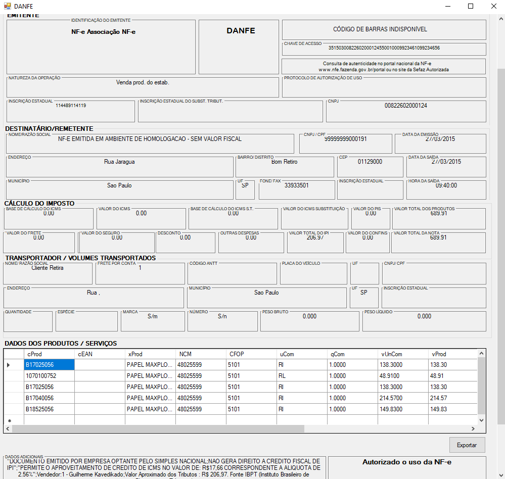

# leitor_xml_nfe

Este programa realiza a leitura de arquivos [XML](https://www.google.com/url?sa=t&rct=j&q=&esrc=s&source=web&cd=&cad=rja&uact=8&ved=2ahUKEwje5cG85ejpAhXmEbkGHY50Cr4QFjAHegQIFhAF&url=https%3A%2F%2Fpt.wikipedia.org%2Fwiki%2FXML&usg=AOvVaw02k6VZIl8t8ijWqrA8WW0V) de [NFEs](https://pt.wikipedia.org/wiki/Nota_fiscal_eletr%C3%B4nica) em formato [Danfe](http://www.nfe.fazenda.gov.br/portal/perguntasFrequentes.aspx?tipoConteudo=Zn7vuWPGHL8=) e converte os dados para um formulário WindowsForms.

